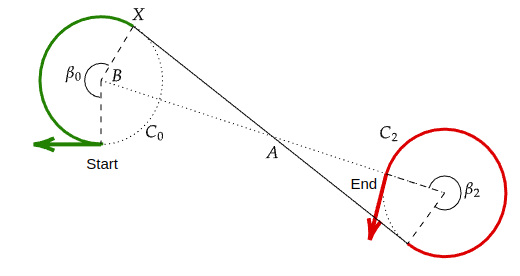
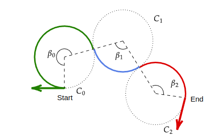
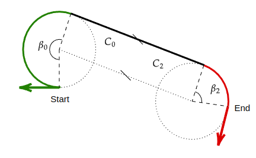
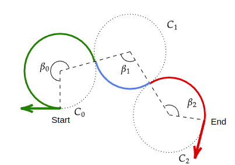
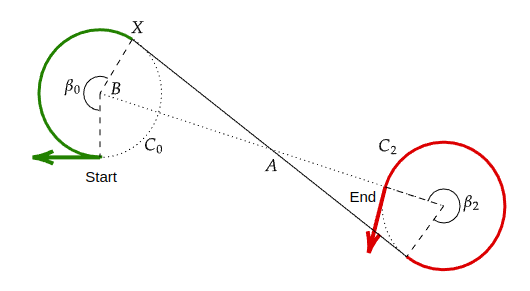
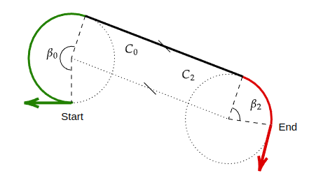
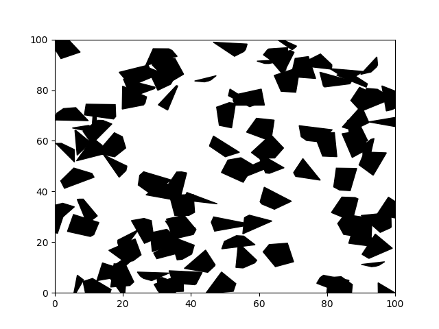
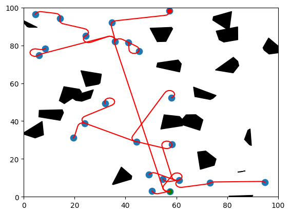
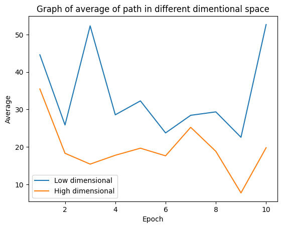
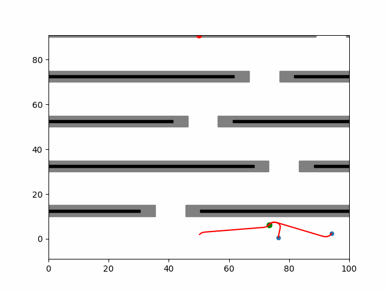

# Cognitive-Robotics
Cognitive Robotics's Miniproject : RRT - planning for "Dubin Car".
Extention of the project RRT_Dubins of FelicienC on GitHub (https://github.com/FelicienC/RRT-Dubins)

## Miniproject 2: 
Goals: 
 - Explain the geomentry of the robot and how RRT is working 
 - Inspect the Code RRT_algorithm and modify it 
 - Generate comment in different situation and explain the differences between the orignal algorithm and RRT-Dubin car
 - Test the code in high and low dimensional space, with different test about the radius of curvature 
 - Extend the code to work also for a circular Robot of diameter D
 - Create a Jupeter notebook file where all is executable


## Table Of Contents

- [RRT Dubins](#RRT-Dubins)
  * [Requirements](#requirements)
  * [Setup](#setup)
  * [Dubins Path](#dubins-path)
    + [How it is work?](#how-it-is-work)
    + [Usage](#usage)
      + [Funcioni vaire](#standalone-execution)
      + [Execution with Rviz](#execution-with-rviz)
  * [RRT](#rrt)
  * [Example tasks](#example-tasks)
    + [Pick and place](#pick-and-place)
    + [Cartesian path planning](#cartesian-path-planning)
  * [Implementation details](#implementation-details)
    + [Workspace modeling and URDF integration](#workspace-modeling-and-urdf-integration)
  * [Acknowledgements](#acknowledgements)


## Setup
To run the code, simply download the repository and execute the 'script.ipynb' file. It contains various modules from which you can individually view the output for each function.
The execution may take some time due to the high number of iterations for certain functions.

## Requirements

- [Scipy](https://www.scipy.org)
- [Numpy](https://numpy.org)
- [Matplotlib](https://matplotlib.org)
- [Shapely](https://pypi.org/project/Shapely)

## Dubins path

Dubins path refers to the shortest curve that connects two points in the two-dimensional Euclidean plane if only one direction of movement is permitted (the vehicle can only go forward). The reason the Dubins path has only six types of combinations is due to the restrictions imposed by the model. This type of path is necessarly in the form of one of 6 types, combination of right turns (**R**), left turns (**L**) and straight segments (**S**): **RLR, LRL, LSR, RSL, LSL, RSR**.


### How does it work ?

As we want to have the shortest path among the 6 potential candidates, we compute the lenght of the path we would obtain if we followed each of the trajectories. To do so, we need to separate three cases:
  1. **LSL** and **RSR** : Two turns in the same direction separated by a straight segment
  2. **LSR** and **RSL** : Two turns in opposite directions separated by a straight segment
  3. **RLR** and **LRL** : Three turns

These combinations represent the shortest paths that a vehicle with a fixed turning radius can take from an initial configuration to a target configuration. By restricting the vehicle's movements to these combinations, the Dubins path planning problem becomes simpler and more computationally efficient.

Here we plot some image of how these six configuratio type woks in way to move between one node and another:
<p align="center">
    
 
</p>


### Usage 

The Dubins path are implemented in the Dubins class. 
In this class is possible to modify the Radius curvatures, is the radius of the turn used in all the potential trajectories, the Point-Separation, the distance between points of the trajectories. More points increase the precision of the path but also augments the computation time of the colision check, and the Robot_diameter that is the diameter of the circular robot.

```python

from dubins import Dubins

# We initialize the planner with the turn radius, the desired distance between consecutive points, and robot_diameter
local_planner = Dubins(radius=2, point_separation=.5, robot_diameter=10)

# We generate two points, x, y, psi
start = (0, 0, 0) # heading east
end = (20, 20, 3.141) # heading west

# We compute the path between them
path = local_planner.dubins_path(start, end)
```
The variable *path* now contains the sequence of points (x, y) linking the start and finish points given as input with only turns of a defined radius and straight line in the form of a (2xn) numpy array.

```python
import matplotlib.pyplot as plt

plt.plot(path[:, 0], path[:, 1])
```


## RRT

### How does it work ?

A Rapidly-exploring Random Tree (RRT) follows an incremental approach to construct a search tree that gradually enhances its resolution, aiming to densely cover the space in the long run. The tree initiates from a starting configuration and expands by utilizing random samples from the search space. When a sample is drawn, an attempt is made to establish a connection between it and the nearest state in the tree. If the connection is feasible, meeting the requirements of passing entirely through free space and adhering to all constraints, the new state is added to the tree.

By employing uniform sampling of the search space, the likelihood of expanding an existing state is directly proportional to the size of its Voronoi region. The Voronoi region represents the collection of points that are closer to this state than to any other state in the graph. Since the states located on the frontier of the search possess the largest Voronoi regions, the tree naturally extends its expansion towards extensive unexplored areas. Consequently, the tree expands rapidly, effectively exploring the search space.

In this project we also add a costrain about the robot, infact it is considered like a circular robot with a dimension of his area on the environment. That area is defined for each function specifying the diameter of the shape. 
This imply that during the RRT algorithm will not consider the path of the nodes where the shape of the robot touching the objects in the environment.  

### Differences between RRT and RRT-Dubin
The key difference between RRT (Rapidly-exploring Random Tree) and RRT Dubin lies in the type of motion that the trees consider.

#### RRT (Rapidly-exploring Random Tree):

 - RRT is a sampling-based algorithm commonly used for motion planning in robotics.
 - It constructs a tree structure incrementally by randomly sampling the configuration space and expanding the tree towards unexplored regions.
 - The connections between the nodes in the tree are made by attempting to connect the sampled configuration to the nearest existing node in the tree.
 - RRT is suitable for systems with continuous and non-holonomic motion, such as wheeled robots or vehicles.
 - It does not consider any specific motion model or constraints, allowing for general exploration of the configuration space.
 - RRT can handle systems with both translational and rotational motions, but it may not guarantee optimality in the generated paths.

#### RRT Dubin:

 - RRT Dubin is an extension of the RRT algorithm specifically designed for systems with Dubin's car-like motion constraints.
 - Dubin's car is a simplified model that represents a vehicle with fixed forward speed and a limited turning radius.
 - RRT Dubin takes into account these motion constraints to generate feasible paths for a Dubin's car.
 - The connections between nodes in the tree are made using Dubin's maneuvers, which are the shortest paths considering the car's motion model.
 - RRT Dubin guarantees the optimality of the generated paths with respect to the Dubin's car model.
 - This variant of RRT is commonly used in applications involving car-like robots or vehicles where the turning radius is restricted.

In summary, RRT is a general-purpose sampling-based algorithm for motion planning, while RRT Dubin specifically caters to systems with Dubin's car-like motion constraints, ensuring optimality in the generated paths within those constraints.

### TODO generate image


### Usage

The rapidly exploring random tree is implemented in the RRT class.
In order to use it, the environment needs to be defined first. To start, two types of environments can be used.

#### Static Environment

In the static environment, the obstacles are polygonal and are stored in a binary search tree in order to increase the speed of the colision check we can modify the number of the obstacles here before to execute the RRT code.
The following code initializes an Environment:
```python
from environment import StaticEnvironment
from rrt import RRT

# We create an environment of 100x100 meters, with 100 obstacles
env = StaticEnvironment((100, 100), 100)
env.plot()
```
<p align="center">
  
</p>

```python
# We initialize the tree with the environment
# The precision needed to stop the algorithm. In the form (delta_x, delta_y, delta_psi)
# the float diameter of the circular robot
rrt = RRT(env, (5, 5, 1), diameter)

# We select two random points in the free space as a start and final node
start = env.random_free_space()
end = env.random_free_space()

# We initialize an empty tree
rrt.set_start(start)

# We run 100 iterations of growth
rrt.run(end, nb_iteration=100)

env.plot()
rrt.plot(nodes=True)
```
<p align="center">
  
</p>

#### Low or High dimentional space works better? 
In the code is possible to execute the 'test_rrt_loop' function, that is used to tested the RRT method for ten epochs in high and low dimensional space and plotting the results: 


<p align="center">
  
</p>

Here is a possible visualization of the average distance that can be achieved between high and low dimensional spaces.

The graph depicts two axes: one representing the epochs executed and the other representing the average distance. As the dimensionality increases, the average distance between points tends to decreases.


#### Dynamic Environment
In the dynamic environement, two options are available: the obstacles can either move or stay static. In both cases, the tree is pruned of the unreachable nodes once they are passed.

```python
from dynamic_environment import DynamicEnvironment
from rrt import RRT

env = DynamicEnvironment((100, 100), 5, moving=False)

```

```python
# We initialize the tree with the environment
diameter = 5
rrt = RRT(env, (5, 5, 1), diameter)

start = (50, 1, 1.57) # At the bottom of the environment
end = (50, 99, 1.57) # At the top of the environment

# Initialisation of the tree, to have a first edge
rrt.set_start(start)
rrt.run(end, 200, metric='local')

```

However, to display several frames at different timestamps, a small loop is required, as follows:
```python
# Initialisation of the position of the vehicle
position = start[:2]
current_edge = rrt.select_best_edge()

# We let it run for a few steps
time = 0
for i in range(500):
    time += 1
    # We check if we are on an edge or if we have to choose a new edge
    if not current_edge.path:
        time = rrt.nodes[current_edge.node_to].time
        current_edge = rrt.select_best_edge()
    # Update the position of the vehicle
    position = current_edge.path.popleft()
    # Update the environment
    #   The frontiers of the sampling and the obstacles
    env.update(position)
    #   The position of the goal
    end = (50, position[1]+90, 1.57)
    # Continue the growth of the tree, we try to add only 2 nodes
    rrt.run(end, 2, metric='local')
    # Ploting and generating an image (the most time consuming step)
    env.plot(time, display=False)
    rrt.plot(file_name='./images/moving'+str(i)+'.png', close=True, nodes=True)
```
This code executes relatively slowly due to the time needed to plot every single frame with matplotlib.
Here is the result obtained by concatenating all the produced images into one gif file.

##### Dynamic Environment static

<p align="center">
  
</p>

##### Dynamic Environment moving

<p align="center">
  
</p>

## References

[Dino Živojević, Jasmin Velagić] "Path Planning for Mobile Robot using Dubins-curve based RRT Algorithm with Differential Constraints" 61 st International Symposium ELMAR-2019, 23-25 September 2019, Zadar, CroatiaUniversity,Faculty of Electrical Engineering/University of Sarajevo
Sarajevo, Bosnia and Herzegovina


[FelicientC]([http://msl.cs.illinois.edu/~lavalle/papers/Lav98c.pdf](https://github.com/FelicienC/RRT-Dubins)) "RRT-Dubins" https://github.com/FelicienC/RRT-Dubins
